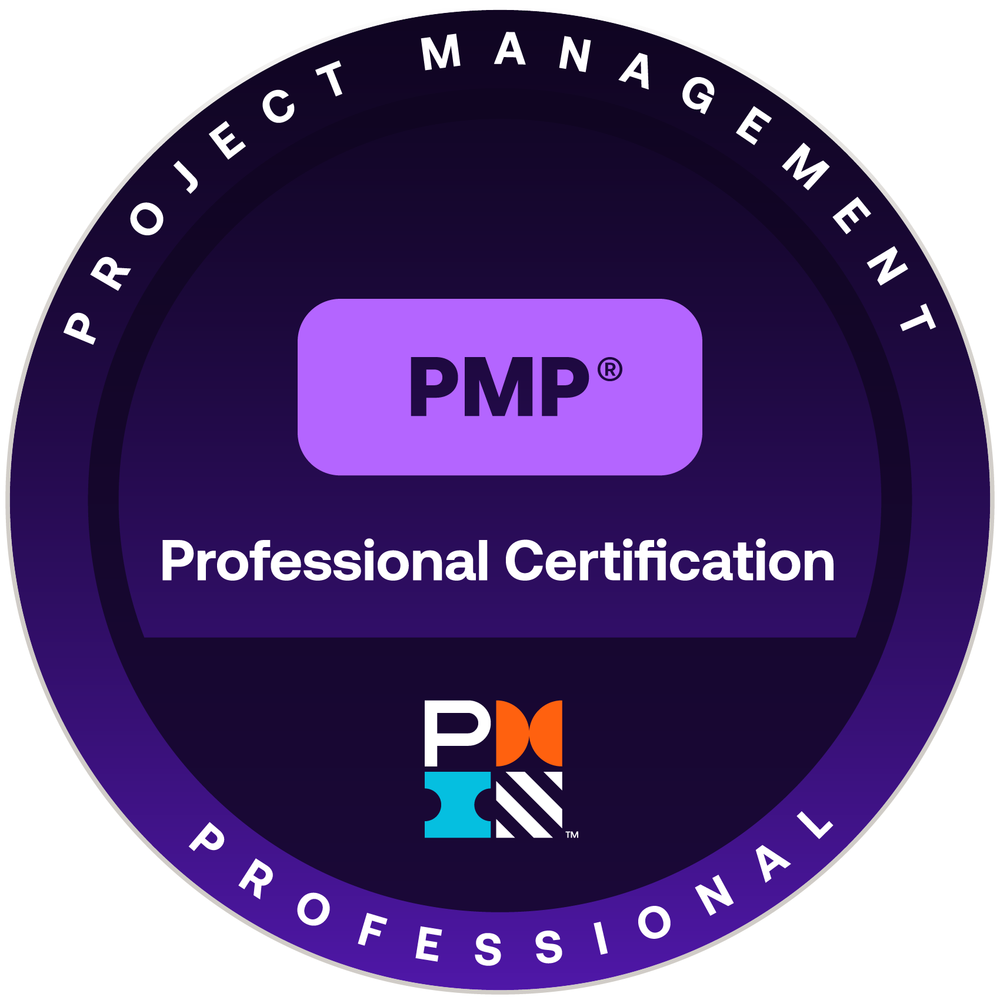

# 🎓 Certifications Portfolio

A collection of my verified certifications across data science, project management, and health informatics.

---

## 🧠 Data & Analytics

| Certification | Issuer | Proof |
|----------------|---------|--------|
|   **MIT Professional Certificate in Data Science and Analytics** | MIT xPRO | [View PDF](./pdfs/mit_datascience_analytics.pdf) |
|    **Microsoft Power BI Data Analyst (PL-300)** | Microsoft | [View PDF](./pdfs/microsoft_powerbi.pdf) |
|    **Microsoft Office Specialist: Excel Expert** | Microsoft | [View PDF](./pdfs/microsoft_excel_expert.pdf) |

---

## 🏗 Project Management & IT

| Certification | Issuer | Proof |
|----------------|---------|--------|
|    **Project Management Professional (PMP)** | Project Management Institute | [View PDF](./pdfs/pmp.pdf) |
|    **ITIL 4 Foundation** | Axelos | [View PDF](./pdfs/itil.pdf) |
|    **Certified ScrumMaster (CSM)** | Scrum Alliance | [View PDF](./pdfs/csm.pdf) |

---

## 💊 Healthcare & Informatics (In Progress)

| Certification | Issuer | Proof |
|----------------|---------|--------|
|   **Certified Associate in Healthcare Information and Management Systems (CAHIMS)** | HIMSS | [View PDF](./pdfs/cahims.pdf) |

---

## 🧩 Badge Wall (Visual Overview)

  
  
  
  
  
  
  

---

## 🔗 Quick Links
- [LinkedIn Profile](https://www.linkedin.com/in/joshuacarisma)
- [Main Portfolio](https://github.com/JoshuaCarisma)
